# Suricata — IoT Network Intrusion Detection & Automated Response

A segmented IoT security lab built using **pfSense, Suricata, Kali Linux, and Ubuntu Server** to demonstrate network intrusion detection, custom rule development, alert tuning, and inline IPS prevention.

---

## Project Overview

The objective of this project was to build an isolated network security environment where controlled attack traffic from a Kali Linux attacker could be detected and blocked before reaching an IoT-style Ubuntu device.

The project demonstrates both **IDS detection** and **IPS prevention** using Suricata integrated with pfSense.

---

## Lab Architecture

                    ATTACK-LAN
                 192.168.60.0/24
                         |
                 Kali Linux
                 192.168.60.100
                         |
                    OPT1 / em2
                         |
                 +---------------+
                 |    pfSense    |
                 |               |
                 | OPT1: em2     |
                 | LAN:  em1     |
                 +-------+-------+
                         |
                    LAN / em1
                         |
                     IOT-LAN
                  192.168.50.0/24
                         |
                  Ubuntu IoT Device
                  192.168.50.101

### Network Segmentation

The lab uses two isolated IPv4 `/24` networks:

- **ATTACK-LAN:** `192.168.60.0/24`
- **IOT-LAN:** `192.168.50.0/24`

pfSense routes traffic between the two networks and provides the firewall and Suricata enforcement point.

### Traffic Path

Traffic originating from Kali follows this path:

Kali
192.168.60.100
      |
      v
OPT1 / em2
      |
      v
pfSense
      |
      v
LAN / em1
      |
      v
IoT Device
192.168.50.101

---

## Technologies Used

- pfSense
- Suricata 7.0.9
- Kali Linux
- Ubuntu Server
- VMware Workstation
- Nmap
- TCP/IP networking
- Custom Suricata rules
- Inline IPS
- Packet capture / tcpdump

---

# Detection Engineering

## 1. Nmap SYN Scan Detection

A custom Suricata rule was created to detect SYN scanning activity from the Kali attacker against the IoT device.

**Source:** `192.168.60.100`

**Destination:** `192.168.50.101`

**Rule SID:** `10000002`

The rule detects TCP SYN packets generated by the attacker:

alert tcp 192.168.60.100 any -> 192.168.50.101 any (msg:"PROJECT2 - NMAP SYN SCAN FROM KALI TO IOT"; flags:S; threshold: type both, track by_src, count 20, seconds 10; sid:10000002; rev:2;)

### Alert Threshold Tuning

The initial Nmap scan generated a large number of repeated alerts.

To reduce alert noise, a threshold was introduced:

threshold: type both, track by_src, count 20, seconds 10

This allowed the rule to identify burst scanning activity while preventing every individual SYN packet from generating a separate alert.

### Evidence

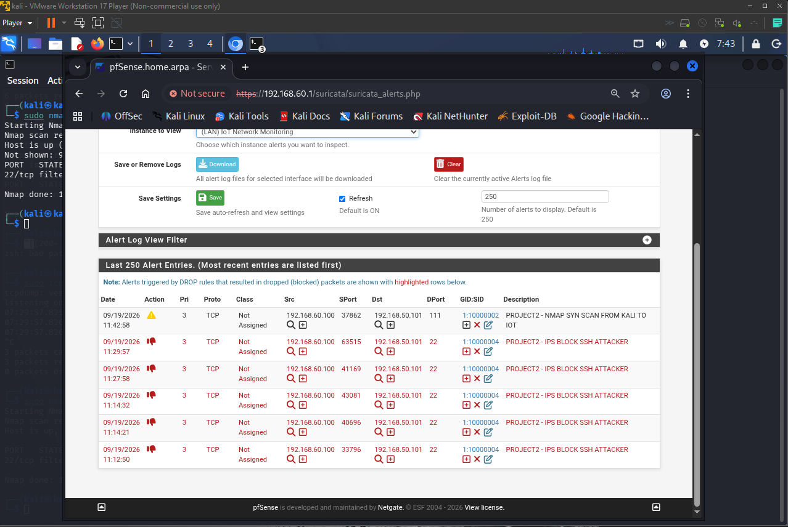

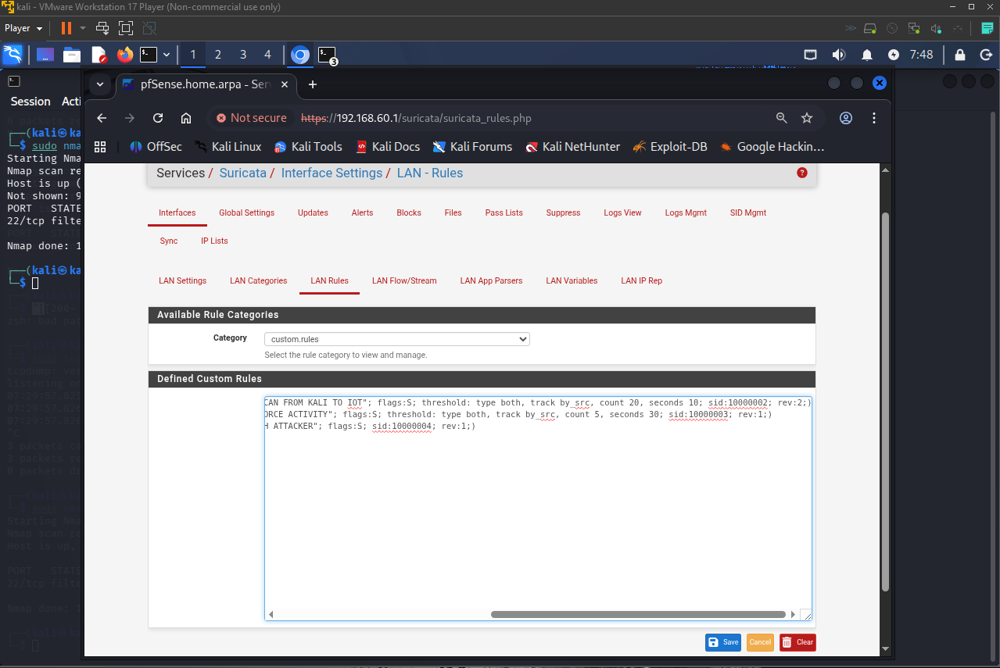

---

## 2. SSH Brute-Force Activity Detection

A second custom rule was created to detect repeated connection attempts against the SSH service running on the IoT device.

**Source:** `192.168.60.100`

**Destination:** `192.168.50.101`

**Destination Port:** `22`

**Rule SID:** `10000003`

The rule uses the following threshold:

threshold: type both, track by_src, count 5, seconds 30

The threshold was validated by testing fewer than five rapid attempts and then five rapid attempts within the configured time window.

### Evidence

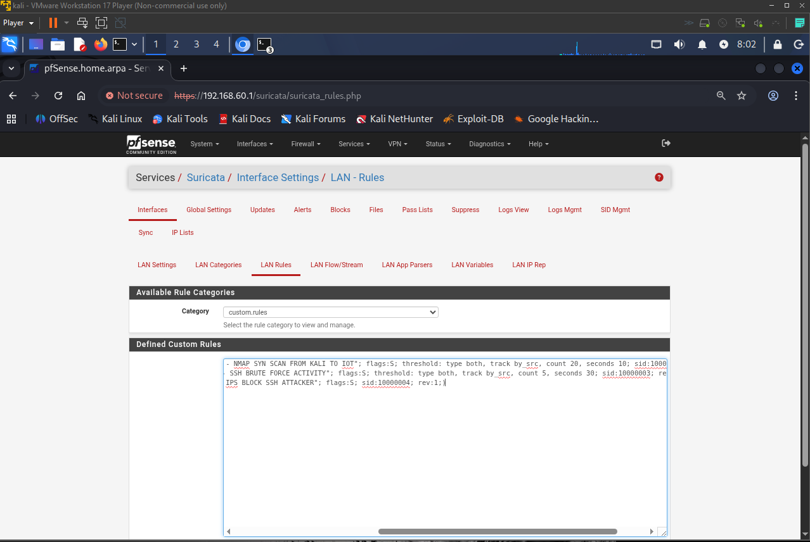

---

# IPS Configuration

## 3. Inline IPS Deployment

The project was extended from detection to prevention by deploying Suricata in **Inline IPS mode**.

Two Suricata instances were used:

- **LAN / em1 — IoT Network Monitoring**
- **OPT1 / em2 — Attack-LAN IPS**

Both instances were configured to run in Inline IPS mode.

### Evidence

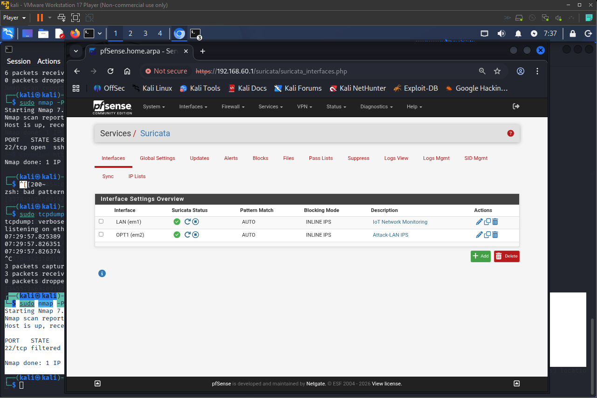

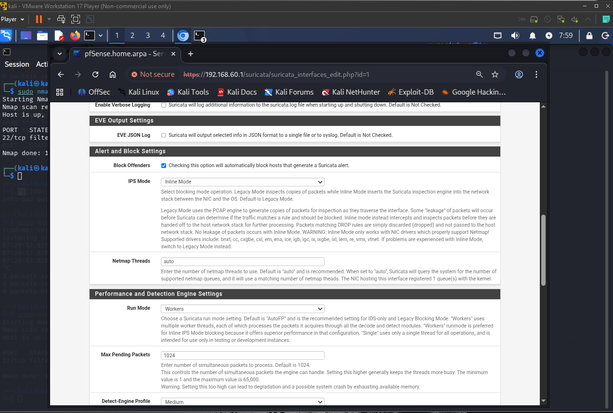

---

## 4. Custom IPS DROP Rule

A custom DROP rule was created to block SSH attack traffic from the Kali attacker to the IoT device.

drop tcp 192.168.60.100 any -> 192.168.50.101 22 (msg:"PROJECT2 - IPS BLOCK SSH ATTACKER"; flags:S; sid:10000004; rev:2;)

The rule specifically targets TCP SYN traffic from the attacker to TCP port `22` on the IoT device.

### Evidence

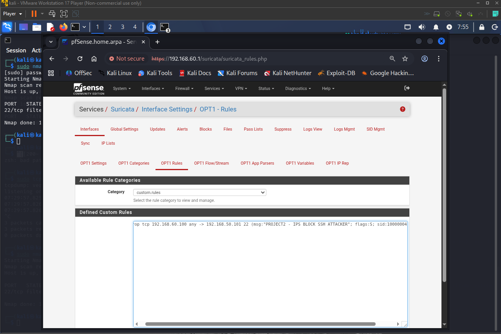

---

# Troubleshooting the IPS

## Initial IPS Enforcement Problem

The first IPS enforcement attempt was configured on the **LAN / em1** Suricata instance because the protected IoT device was connected to the LAN interface.

Suricata generated DROP events, but the SSH service was still reachable.

This indicated that the rule was matching traffic but the traffic was not being prevented at the correct point in the network path.

---

## Packet-Level Investigation

Packet capture was used to investigate the traffic.

The observed traffic showed:

Kali → IoT     SYN
IoT → Kali     SYN-ACK
Kali → IoT     RST

The important observation was that the IoT device was still returning a SYN-ACK to Kali.

This proved that the SSH traffic was still reaching the IoT host.

---

## Identifying the Correct Enforcement Point

The traffic path was then traced based on the source network.

Kali is located on:

ATTACK-LAN
192.168.60.0/24

with:

192.168.60.100

The gateway for that network is pfSense OPT1:

OPT1 / em2
192.168.60.1

Therefore, traffic originating from Kali enters pfSense through **OPT1 / em2** before being routed toward the IoT LAN.

The correct traffic path is:

Kali
192.168.60.100
      |
      v
OPT1 / em2
      |
      v
pfSense
      |
      v
LAN / em1
      |
      v
IoT
192.168.50.101

The IPS enforcement was therefore moved to the **OPT1 / em2** interface, where the attacker traffic enters pfSense.

---

# Final IPS Configuration

An Inline IPS instance named **Attack-LAN IPS** was configured on OPT1 / em2.

The instance was configured with:

- **Block Offenders:** Enabled
- **IPS Mode:** Inline Mode
- **Run Mode:** Workers
- Custom DROP rule `10000004`

### Evidence

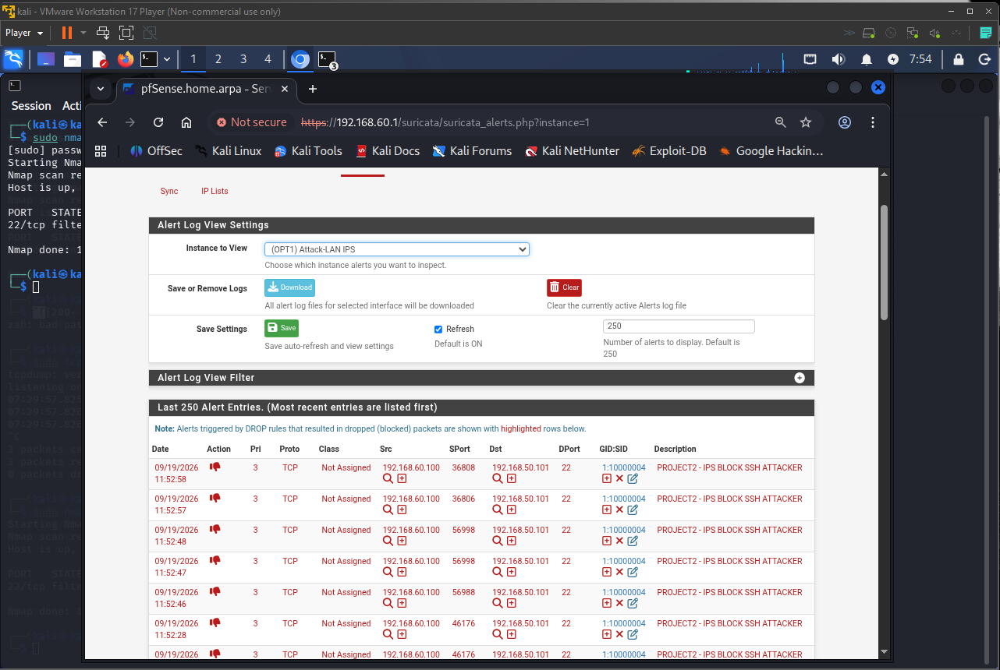

The Suricata alerts showed:

1:10000004
PROJECT2 - IPS BLOCK SSH ATTACKER

with the action:

DROP

---

# Final Prevention Validation

The final IPS test was performed from Kali using:

sudo nmap -Pn -sS --reason -p 22 192.168.50.101

### Before Correct Inline Enforcement

The SSH service was reachable:

22/tcp open ssh syn-ack ttl 63

This indicated that the target was responding to the SYN packet.

### After Correct Inline Enforcement

The result changed to:

22/tcp filtered ssh no-response

This indicated that the SYN was no longer receiving a response because the IPS was blocking the traffic.

### Evidence

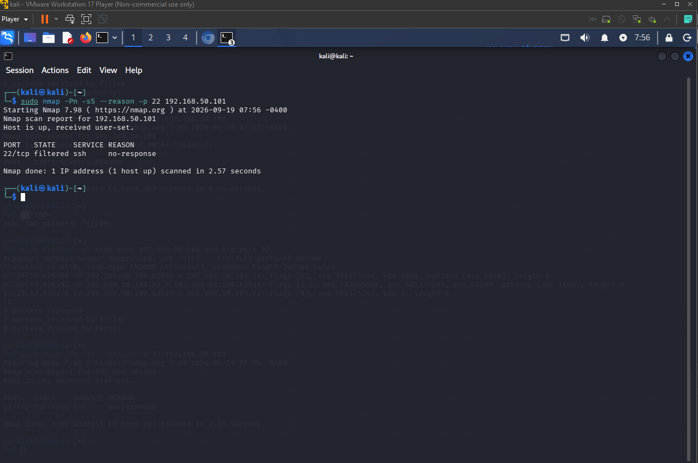

Together, the Suricata DROP event and the Nmap `filtered / no-response` result provide evidence of end-to-end IPS prevention.

---

# HOME_NET Configuration

Suricata's configured HOME_NET included both lab networks:

192.168.50.0/24
192.168.60.0/24

This was important when evaluating Suricata's built-in rules because both the attacker and IoT networks were considered internal networks.

As a result, some rules based on:

$EXTERNAL_NET -> $HOME_NET

were not necessarily appropriate for detecting traffic originating from the internal ATTACK-LAN and targeting the internal IOT-LAN.

Custom rules were therefore used to explicitly define the attacker and target addresses for this lab.

### Evidence

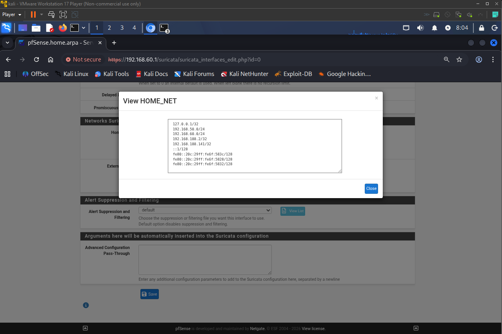

---

# Network Configuration Evidence

## pfSense Interface Assignments

The pfSense interfaces were configured as:

| Interface | pfSense Device | Network |
|---|---|---|
| WAN | em0 | NAT |
| LAN | em1 | IOT-LAN |
| OPT1 | em2 | ATTACK-LAN |

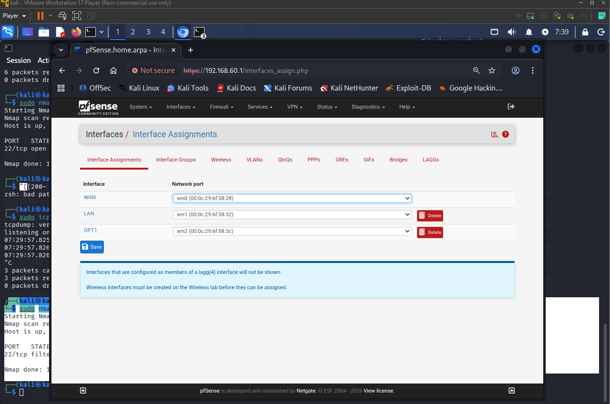

## Kali Attacker

eth0
192.168.60.100/24

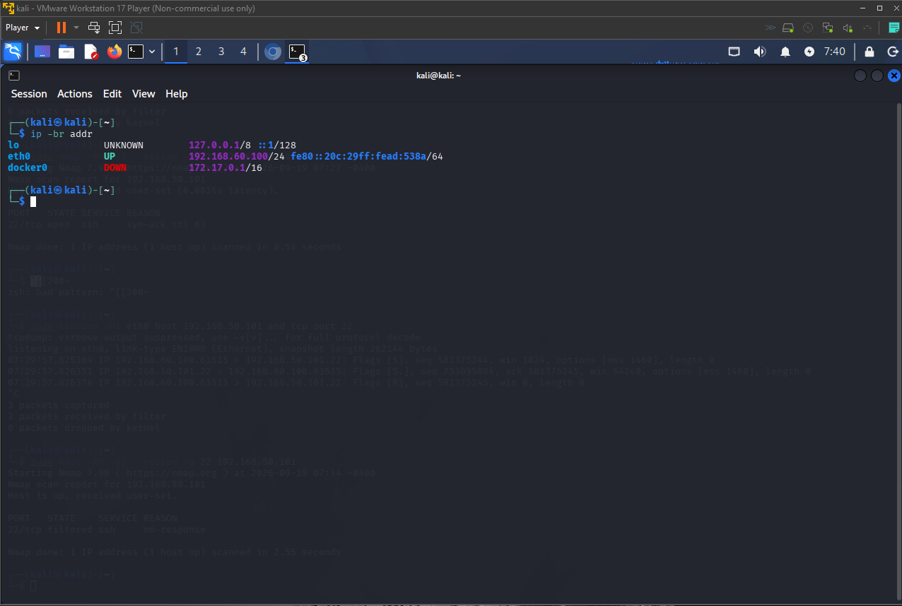

## IoT Device

ens33
192.168.50.101/24

SSH was listening on TCP port `22`.

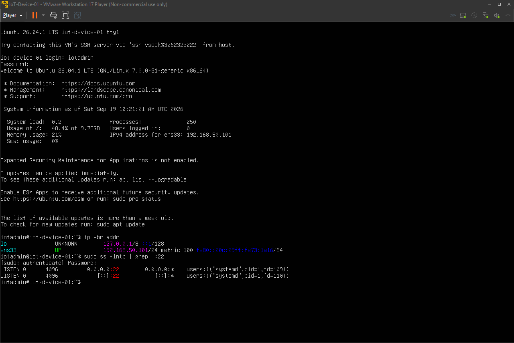

---

# Security Workflow

The completed project demonstrates an end-to-end network security workflow:

                 Attack Traffic
                       |
                       v
              Network Segmentation
                       |
                       v
              pfSense Firewall
                       |
                       v
              Suricata Detection
                       |
                       v
             Custom Detection Rules
                       |
                       v
                 Alert Tuning
                       |
                       v
                 Inline IPS
                       |
                       v
                  DROP Action
                       |
                       v
             Prevention Validation

---

# Key Learning Outcomes

- Network segmentation using separate IPv4 subnets
- Understanding `/24` network addressing
- Routing between isolated networks through pfSense
- Understanding firewall interface direction
- Understanding packet flow through a routed firewall
- Suricata IDS/IPS configuration
- Custom Suricata rule development
- TCP SYN-based detection
- Nmap reconnaissance detection
- SSH attack detection
- Threshold tuning to reduce alert noise
- Inline IPS deployment
- DROP rule configuration
- Packet-level troubleshooting using tcpdump
- Identifying the correct IPS enforcement point
- Validating prevention using Nmap

---

# Project Result

The project successfully demonstrates both **network intrusion detection** and **inline prevention** in an isolated IoT security environment.

The final implementation can:

1. Detect Nmap SYN scanning.
2. Detect repeated SSH connection attempts.
3. Tune detection thresholds to reduce alert noise.
4. Identify the correct network interface for IPS enforcement.
5. Block attacker traffic using an Inline IPS DROP rule.
6. Validate the prevention result at the network level.

The final SSH test changed from:

22/tcp open ssh

to:

22/tcp filtered ssh no-response

after the correct Inline IPS enforcement was deployed.

---

# Project Evidence

The repository contains screenshots documenting:

- pfSense interface assignments
- Kali and IoT network configuration
- Suricata Inline IPS status
- Nmap detection
- Detection threshold tuning
- SSH brute-force detection rule
- IPS DROP rule
- OPT1 Inline IPS configuration
- Suricata DROP alerts
- Final Nmap prevention result
- Suricata HOME_NET configuration

---

## Disclaimer

This project was conducted in an isolated VMware lab using systems and networks controlled for testing purposes. No unauthorized systems or external networks were targeted.
